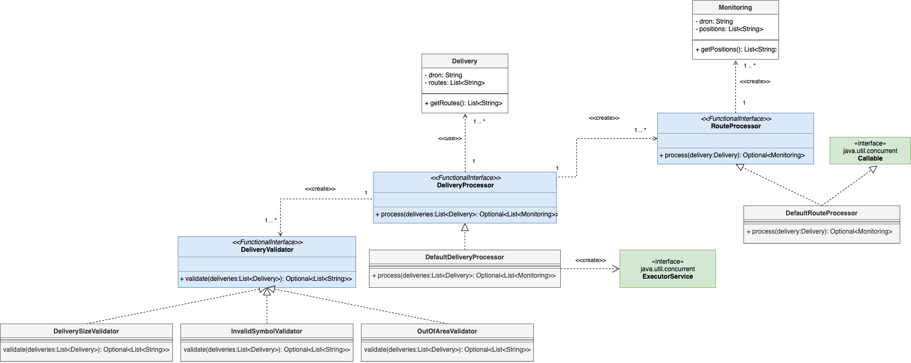

# Food Delivery with Drones

This Java application reads a list of files with the routes for food delivery performed by drones, and concurrently, it prints out the instructions of movement according to the files, and calculates the final position of each drone after the delivery task that written out to a report. 



*DeliveryProcessor* takes a list of instructions for deliveries, validates each set of instructions using a chain of validators, calculates partial drone movements per single delivery using *RouteProcessor* and generates a report with the final position of the drone for each delivery. *DefaultDeliveryProcessor* uses the *ExecutorService* to operate the 20 drones concurrently.

*Delivery* and *Monitoring* are domain classes to represent input and output data flowing through the application. Delivery is the input info with the drone name and list of instructions given by the owner, Monitoring is the output info including the drone name and list of final position for each delivery performed.

New implementations of *DeliveryProcessor* and *RouteProcessor* would allow different ways of processing the input delivery instructions (e.g. use a different concurrency mechanism) and support formats of input files. In that case, the main class **DeliveryApp** should be generalized in order to identify the specific classes to instantiate according to the new specific processing mechanism of new instructions format.

## Running the app

The application gets 1 optional argument:

* **Restaurant folder name:** Folder name of the restaurant to process. This argument is optional, so if this is empty, the application will try to read files in the folder **files/restaurant1/*.txt**.

Therefore, to invoke the application you should run the following commands:

```
# Go the root folder
cd delivery

# Build the app
gradle build

# Run the app
gradle run
gradle run --args restaurant1

# If you don't have gradle installed locally, you can use the gradle wrapper
./gradlew build
./gradlew run
./gradlew run --args restaurant1

```
## Unit Testing

Unit tests are executed during **gradle build** or can be re-executed with **gradle test**.

```
# Go the root folder
cd delivery

# Run the tests
gradle test

```

The final report can be found in *build/reports/tests/test/index.html*


## Logging

The application uses the Java Logging API. 

You can set up the logging level in [src/main/resources/logging.properties](src/main/resources/logging.properties) and build again.

The following lists the Log Levels in descending order:

* SEVERE (highest)
* WARNING
* INFO
* CONFIG
* FINE
* FINER
* FINEST


